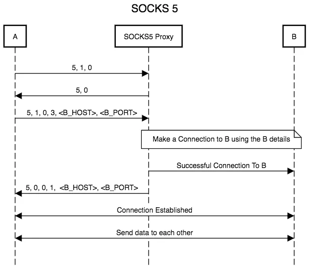

# GoSshSocks

[WIP] Proxy through SSH tunnel using go 

 

  
    
  Little project to learn how the socks5 protocol works and build something by our hands. 

 

## Why ?
Basically, to redirect your connection through ssh server, a bit like a vpn, poor man's vpn.

## From:
- [Medium SOCKS 5 - A Proxy Protocol](https://medium.com/@nimit95/socks-5-a-proxy-protocol-b741d3bec66c)
- [rfc-editor.org](https://www.rfc-editor.org/rfc/rfc1928)
